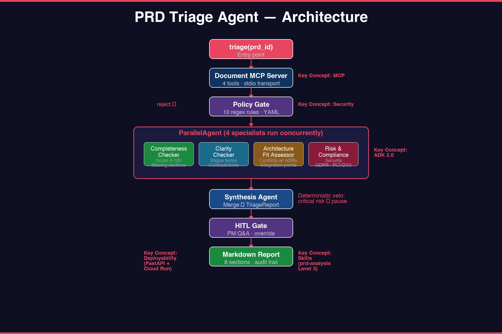

# PRD Triage Agent

> Multi-agent PRD intake checkup for software teams. Built for the Google × Kaggle **AI Agents Intensive Vibe Coding Capstone Project** (2026).



**Track**: Agents for Business  
**Key Concepts**: ADK · MCP · Antigravity · Security · Deployability · Skills (target: 6/6)

---

## Problem

Software teams receive PRDs that lack acceptance criteria, conflict with existing architecture, carry compliance risks, or use ambiguous terms. Static linters catch formatting issues but can't judge whether a PRD is *executable*. Engineers discover these gaps mid-implementation, causing rework and missed estimates.

## Solution

A multi-agent pipeline that triages PRDs before engineering begins:

1. **Policy gate** — rejects PRDs containing API keys, emails, or secrets (regex + PII patterns).
2. **Parallel specialist analysis** — 4 ADK agents analyze the same PRD concurrently:
   - **Completeness Checker** — are all 5 required sections present?
   - **Clarity Checker** — vague terms, contradictions, undefined jargon?
   - **Architecture Fit** — conflicts with existing system + ADRs?
   - **Risk & Compliance** — security, GDPR, PCI-DSS risks?
3. **Synthesis** — merges findings into a `TriageReport` with verdict (`pass` / `needs_clarification` / `reject`).
4. **HITL gate** — pauses pipeline on critical findings, generates clarifying questions for the PM.
5. **Estimation + Task Breakdown** — (bonus) effort estimate with confidence interval + ticket decomposition.

## Architecture

```
                    ┌─────────────────────────────────┐
                    │         triage(prd_id)           │
                    └──────────────┬──────────────────┘
                                   │
                          ┌────────▼────────┐
                          │  Document MCP   │
                          │  Server (4 tools)│
                          └────────┬────────┘
                                   │ get_prd()
                          ┌────────▼────────┐
                          │  Policy Gate    │──reject──► TriageReport(reject)
                          │  (regex + PII)  │
                          └────────┬────────┘
                                   │ allowed
                    ┌──────────────▼──────────────┐
                    │   ParallelAgent (fan-out)    │
                    ├──────────┬──────────┬───────┐│
                    │Completeness│ Clarity │Arch│Risk│
                    └──────────┴──────────┴───┴───┘│
                              └─────────┬──────────┘
                                        │
                          ┌─────────────▼─────────────┐
                          │   Synthesis Agent          │
                          │   (critical-risk veto)     │
                          └─────────────┬─────────────┘
                                        │
                          verdict: pass / needs_clarification
                                        │
                          ┌─────────────▼─────────────┐
                          │   HITL Gate (D5)           │
                          │   pause → PM Q&A → resume  │
                          └─────────────┬─────────────┘
                                        │
                          ┌─────────────▼─────────────┐
                          │  Estimation + Breakdown    │
                          │  (D7 bonus)                │
                          └─────────────┬─────────────┘
                                        │
                          ┌─────────────▼─────────────┐
                          │  Markdown Report Writer    │
                          │  reports/<id>-<ts>.md      │
                          └───────────────────────────┘
```

**Key Concepts mapping**:

| Concept | Where | Code |
|---|---|---|
| **ADK** | ParallelAgent fan-out + SequentialAgent pipeline + LlmAgent specialists | `src/agents/` |
| **MCP** | Custom Document MCP server (4 tools, stdio transport) | `src/doc_mcp/` |
| **Antigravity** | IDE for development + custom Skill triggers pipeline (Video) | `.agents/skills/` |
| **Security** | Policy gate (10 regex rules) + HITL + critical-risk veto | `src/policy/` |
| **Deployability** | Dockerfile + Cloud Run + FastAPI endpoint (Video) | `Dockerfile`, `src/main.py` |
| **Skills** | `prd-analysis` Level 3 procedural skill | `.agents/skills/prd-analysis/` |

## Setup

### Prerequisites

- Python 3.12+ (managed by uv)
- [uv](https://docs.astral.sh/uv/) package manager
- Google AI Studio API key ([get one](https://aistudio.google.com/apikey))

### Install

```bash
# Clone the repo, then:
uv sync --extra dev

# Set your Gemini API key
export GOOGLE_API_KEY="your-key-here"

# Verify installation
uv run python -c "import google.adk; import mcp; import pydantic; print('OK')"
```

### Run tests

```bash
uv run pytest                          # all tests (89 pass, 4 skip without API key)
uv run pytest tests/test_mcp_server.py # MCP server only
uv run pytest tests/test_policy.py     # Policy gate only
```

## Usage

### Interactive playground (ADK Web UI)

```bash
uv run adk web
# Open http://localhost:8000, select "agents" from the dropdown
```

### CLI

```bash
uv run adk run agents
# Type your PRD content, the pipeline will analyze it
```

### Programmatic

```python
from agents.orchestrator import triage

report = triage("prd-001")
print(report.verdict)        # pass / needs_clarification / reject
print(report.completeness)   # CompletenessReport
```

### API server (local)

```bash
uv run uvicorn src.main:app --reload --port 8080
curl -X POST localhost:8080/triage -H 'Content-Type: application/json' -d '{"prd_id":"prd-001"}'
```

## Demo cases

The repository ships with 5 sample PRDs in `data/prds/`:

| PRD | Purpose | Expected verdict |
|---|---|---|
| `prd-001` Dark Mode | Complete PRD, all sections present | `pass` |
| `prd-002` Wishlist | Missing acceptance criteria | `needs_clarification` (completeness < 60) |
| `prd-003` Stripe Payment | Contains embedded API key | `reject` (policy gate) |
| `prd-004` Search Perf | Vague terms ("fast", "scalable") | `needs_clarification` (clarity) |
| `prd-005` Inventory Sync | Well-scoped feature | `pass` |

```bash
# Run each demo case:
for id in prd-001 prd-002 prd-003 prd-004 prd-005; do
    echo "=== $id ==="
    uv run python -c "from agents.orchestrator import triage; r=triage('$id'); print(r.verdict, r.status)"
done
```

## Deployment

### Current: cloudflared tunnel (live now)

The agent is deployed via uvicorn + cloudflared quick tunnel — no Docker or GCP required:

```bash
# Start the server
nohup uv run uvicorn src.main:app --host 0.0.0.0 --port 8080 &

# Create a public tunnel
nohup cloudflared tunnel --url http://localhost:8080 &

# Test the public endpoint
curl https://<tunnel-url>.trycloudflare.com/health
curl -X POST https://<tunnel-url>.trycloudflare.com/triage \
    -H 'Content-Type: application/json' -d '{"prd_id":"prd-003"}'
```

### Target: Google Cloud Run (when Docker is available)

```bash
export GOOGLE_API_KEY="..."
export GCP_PROJECT="your-project-id"
bash scripts/deploy.sh
```

### Fallback: local + ngrok

If neither Cloud Run nor cloudflared is available:

```bash
uv run uvicorn src.main:app --host 0.0.0.0 --port 8080
ngrok http 8080
```

## Project structure

```
Project/
├── src/
│   ├── agents/
│   │   ├── orchestrator.py      # Root pipeline (SequentialAgent + ParallelAgent)
│   │   ├── completeness.py      # Completeness Checker (LlmAgent)
│   │   ├── clarity.py           # Clarity Checker (LlmAgent)
│   │   ├── architecture.py      # Architecture Fit Assessor (LlmAgent + MCP tool)
│   │   ├── risk.py              # Risk & Compliance Checker (LlmAgent)
│   │   └── synthesis.py         # Synthesis Agent (LlmAgent → TriageReport)
│   ├── doc_mcp/
│   │   ├── server.py            # Document MCP server entry (FastMCP, stdio)
│   │   └── repository.py        # File I/O + embedding logic
│   ├── models/
│   │   └── schemas.py           # All Pydantic schemas
│   ├── policy/
│   │   ├── checker.py           # Policy gate (regex scan)
│   │   └── policies.yaml        # 10 regex rules (human-reviewable)
│   ├── main.py                  # FastAPI server for Cloud Run
│   └── report.py                # Markdown report formatter
├── data/
│   ├── prds/                    # 5 sample ShopFlow PRDs
│   └── architecture/            # System architecture + 3 ADRs
├── tests/                       # 89 tests (14 MCP + 20 models + 13 policy + 17 report + 25 structure)
├── openspec/                    # Spectra spec-driven development
│   └── changes/add-prd-triager/ # This project's change proposal
├── .agents/
│   └── skills/prd-analysis/     # Custom ADK Skill (Level 3)
├── Dockerfile                   # Cloud Run image
├── pyproject.toml               # uv-managed dependencies
└── README.md                    # This file
```

## Tech stack

| Layer | Technology | Course day |
|---|---|---|
| LLM | Gemini 2.5 Flash (via `google-genai`) | Day 1 |
| Agent framework | Google ADK 2.3.0 | Day 3-4 |
| Tool protocol | MCP 1.x (FastMCP server) | Day 2 |
| Policy / Security | Custom regex engine + YAML rules | Day 4 |
| Web server | FastAPI + Uvicorn | Day 5 |
| Deployment | Docker + Google Cloud Run | Day 5 |
| Package manager | uv | — |
| Testing | pytest + pytest-asyncio | — |
| Spec-driven dev | Spectra (openspec/) | Day 5 |

## License

MIT
