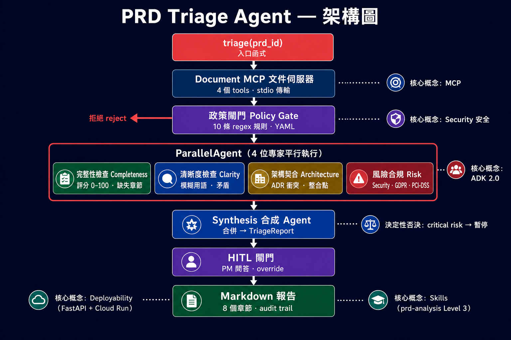
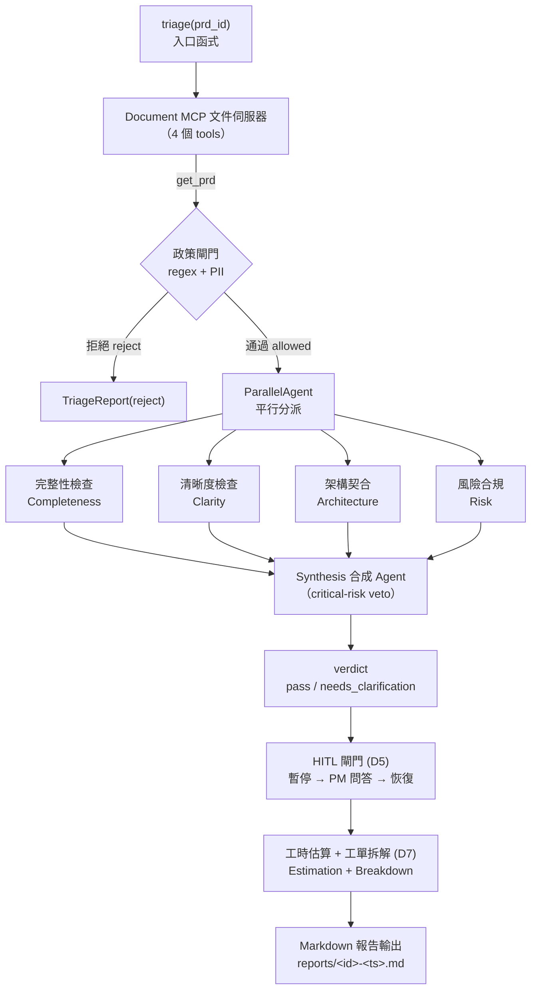

# PRD Triage Agent

**Languages / 語言**: [English](README.md) · 繁體中文

> 面向軟體團隊的多 Agent PRD 收案健檢系統。為 Google × Kaggle **AI Agents Intensive Vibe Coding Capstone Project**（2026）而建。



**賽道**：Agents for Business  
**核心概念**：ADK · MCP · Antigravity · Security · Deployability · Skills（目標 6/6）

---

## 問題

軟體團隊收到的 PRD 常缺少驗收標準、與現有架構衝突、帶有合規風險，或使用模糊用語。靜態 linter 只能抓格式問題，無法判斷 PRD 是否*可執行*。工程師往往在實作中途才發現缺口，導致返工與估時失準。

## 解法

在工程開工前對 PRD 進行 triage 的多 Agent pipeline：

1. **Policy gate** — 以 regex + PII 模式拒絕含 API key、email 或機密的 PRD。
2. **平行專家分析** — 4 個 ADK agent 同時分析同一份 PRD：
   - **Completeness Checker** — 5 個必要章節是否齊全？
   - **Clarity Checker** — 模糊用語、矛盾、未定義術語？
   - **Architecture Fit** — 是否與現有系統 + ADR 衝突？
   - **Risk & Compliance** — 安全、GDPR、PCI-DSS 等風險？
3. **Synthesis** — 合併結果為 `TriageReport`，含 verdict（`pass` / `needs_clarification` / `reject`）。
4. **HITL gate** — 遇關鍵發現時暫停 pipeline，為 PM 產生釐清問題。
5. **Estimation + Task Breakdown**（加分）— 含信賴區間的工時估算 + 工單拆解。

## 架構



> 上圖為 Mermaid 流程圖，在 GitHub / VS Code 預覽中可直接渲染。英文 ASCII 版見 [README.md](README.md#architecture)。

**核心概念對照**：

| 概念 | 位置 | 程式碼 |
|---|---|---|
| **ADK** | ParallelAgent fan-out + SequentialAgent pipeline + LlmAgent 專家 | `src/agents/` |
| **MCP** | 自訂 Document MCP server（4 tools、stdio transport） | `src/doc_mcp/` |
| **Antigravity** | 開發 IDE + 自訂 Skill 觸發 pipeline（影片） | `.agents/skills/` |
| **Security** | Policy gate（10 條 regex）+ HITL + critical-risk veto | `src/policy/` |
| **Deployability** | Dockerfile + Cloud Run + FastAPI endpoint（影片） | `Dockerfile`, `src/main.py` |
| **Skills** | `prd-analysis` Level 3 程序型 skill | `.agents/skills/prd-analysis/` |

## 安裝設定

### 前置需求

- Python 3.12+（由 uv 管理）
- [uv](https://docs.astral.sh/uv/) 套件管理器
- Google AI Studio API key（[取得金鑰](https://aistudio.google.com/apikey)）

### 安裝

```bash
# Clone repo 後：
uv sync --extra dev

# 設定 Gemini API key（擇一）
# 方式 A：.env 檔（推薦）
cp .env.example .env
# 編輯 .env，填入 GOOGLE_API_KEY=your-key-here

# 方式 B：終端機 export
export GOOGLE_API_KEY="your-key-here"

# 驗證安裝
uv run --env-file .env python -c "import google.adk; import mcp; import pydantic; print('OK')"
```

> **提示**：本專案需用 `uv run --env-file .env` 載入 `.env` 中的 API key；或先 `export GOOGLE_API_KEY` 再執行 `uv run`。

### 執行測試

```bash
uv run --env-file .env pytest                          # 全部測試（無 API key 時 4 個 skip）
uv run --env-file .env pytest tests/test_mcp_server.py # 僅 MCP server
uv run --env-file .env pytest tests/test_policy.py     # 僅 Policy gate
```

## 使用方式

### 互動式 playground（ADK Web UI）

```bash
uv run --env-file .env adk web
# 開啟 http://localhost:8000，從下拉選單選 "agents"
```

### CLI

```bash
uv run --env-file .env adk run agents
# 輸入 PRD 內容，pipeline 會進行分析
```

### 程式呼叫

```python
from agents.orchestrator import triage

report = triage("prd-001")
print(report.verdict)        # pass / needs_clarification / reject
print(report.completeness)   # CompletenessReport
```

### 本地 API server

```bash
uv run --env-file .env uvicorn src.main:app --reload --port 8080
curl -X POST localhost:8080/triage -H 'Content-Type: application/json' -d '{"prd_id":"prd-001"}'
```

## Demo 案例

repo 內含 5 份範例 PRD（`data/prds/`）：

| PRD | 用途 | 預期 verdict |
|---|---|---|
| `prd-001` Dark Mode | 完整 PRD，章節齊全 | `pass` |
| `prd-002` Wishlist | 缺少驗收標準 | `needs_clarification`（completeness < 60） |
| `prd-003` Stripe Payment | 內嵌 API key | `reject`（policy gate） |
| `prd-004` Search Perf | 模糊用語（"fast"、"scalable"） | `needs_clarification`（clarity） |
| `prd-005` Inventory Sync | 範圍明確的功能 | `pass` |

```bash
# 逐一執行 demo：
for id in prd-001 prd-002 prd-003 prd-004 prd-005; do
    echo "=== $id ==="
    uv run --env-file .env python -c "from agents.orchestrator import triage; r=triage('$id'); print(r.verdict, r.status)"
done
```

## 部署

### 現況：cloudflared tunnel（已上線）

以 uvicorn + cloudflared quick tunnel 部署，無需 Docker 或 GCP：

```bash
# 啟動 server
nohup uv run --env-file .env uvicorn src.main:app --host 0.0.0.0 --port 8080 &

# 建立公開 tunnel
nohup cloudflared tunnel --url http://localhost:8080 &

# 測試公開 endpoint
curl https://<tunnel-url>.trycloudflare.com/health
curl -X POST https://<tunnel-url>.trycloudflare.com/triage \
    -H 'Content-Type: application/json' -d '{"prd_id":"prd-003"}'
```

### 目標：Google Cloud Run（有 Docker 時）

```bash
export GOOGLE_API_KEY="..."
export GCP_PROJECT="your-project-id"
bash scripts/deploy.sh
```

### 備援：本地 + ngrok

若 Cloud Run 與 cloudflared 皆不可用：

```bash
uv run --env-file .env uvicorn src.main:app --host 0.0.0.0 --port 8080
ngrok http 8080
```

## 專案結構

```
Project/
├── src/
│   ├── agents/
│   │   ├── orchestrator.py      # 根 pipeline（SequentialAgent + ParallelAgent）
│   │   ├── completeness.py      # Completeness Checker（LlmAgent）
│   │   ├── clarity.py           # Clarity Checker（LlmAgent）
│   │   ├── architecture.py      # Architecture Fit Assessor（LlmAgent + MCP tool）
│   │   ├── risk.py              # Risk & Compliance Checker（LlmAgent）
│   │   └── synthesis.py         # Synthesis Agent（LlmAgent → TriageReport）
│   ├── doc_mcp/
│   │   ├── server.py            # Document MCP server 入口（FastMCP, stdio）
│   │   └── repository.py        # 檔案 I/O + embedding 邏輯
│   ├── models/
│   │   └── schemas.py           # 所有 Pydantic schema
│   ├── policy/
│   │   ├── checker.py           # Policy gate（regex 掃描）
│   │   └── policies.yaml        # 10 條 regex 規則（可人工審閱）
│   ├── main.py                  # Cloud Run 用 FastAPI server
│   └── report.py                # Markdown 報告 formatter
├── data/
│   ├── prds/                    # 5 份 ShopFlow 範例 PRD
│   └── architecture/            # 系統架構 + 3 份 ADR
├── tests/                       # 測試套件
├── openspec/                    # Spectra 規格驅動開發
│   └── changes/add-prd-triager/ # 本專案 change proposal
├── .agents/
│   └── skills/prd-analysis/     # 自訂 ADK Skill（Level 3）
├── Dockerfile                   # Cloud Run 映像
├── pyproject.toml               # uv 管理依賴
├── README.md                    # 英文版
└── README.zh-TW.md              # 繁體中文版（本文件）
```

## 技術棧

| 層級 | 技術 | 課程天數 |
|---|---|---|
| LLM | Gemini 2.5 Flash（via `google-genai`） | Day 1 |
| Agent 框架 | Google ADK 2.3.0 | Day 3-4 |
| Tool 協定 | MCP 1.x（FastMCP server） | Day 2 |
| Policy / Security | 自訂 regex engine + YAML 規則 | Day 4 |
| Web server | FastAPI + Uvicorn | Day 5 |
| 部署 | Docker + Google Cloud Run | Day 5 |
| 套件管理 | uv | — |
| 測試 | pytest + pytest-asyncio | — |
| 規格驅動開發 | Spectra（openspec/） | Day 5 |

## 授權

MIT
